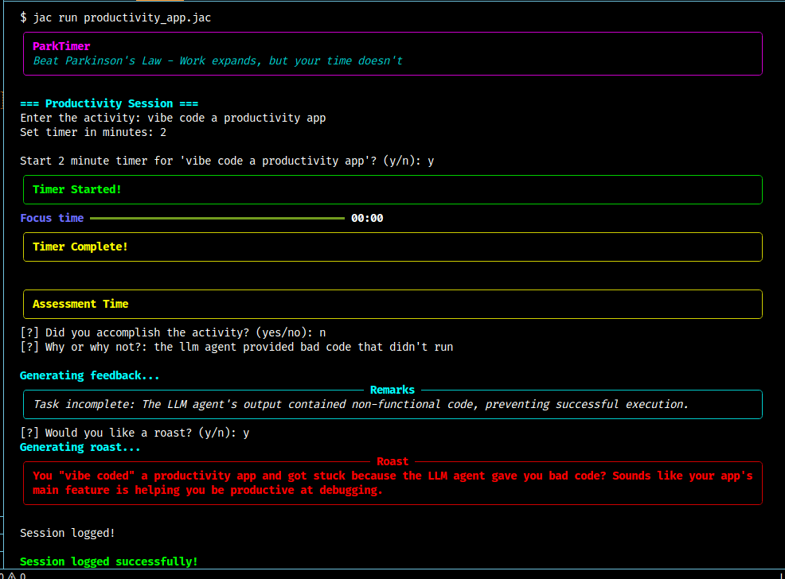

# ParkTimer

### Beat Parkinson's Law - Work expands, but your time doesn't

ParkTimer is an activity-specific timer designed to help users analyze the completion of work within allocated time, fostering a sense of urgency to complete tasks in the shortest possible duration.

## Features
- Activity-specific timing for focused work sessions
- Analysis of work completion within set time limits
- LLM-powered roast option for motivation on future related tasks
- Standard timer and feedback mechanisms

## Installation
1. Clone the repository: `git clone https://github.com/mutaician/Gen-AI-ouk.git`
2. Navigate to the project directory: `cd Gen-AI-ouk/assignment-1`
3. Ensure `uv` is installed (refer to [uv documentation](https://github.com/astral-sh/uv)). If not, install it first.
4. Create and activate a virtual environment:
   - `uv venv`
   - For Linux/macOS: `source .venv/bin/activate`
   - For Windows: `.venv\Scripts\activate`
5. Install dependencies: `uv sync`
6. Obtain a Gemini API key from [Google AI Studio](https://aistudio.google.com/) (it's free)
7. Export the API key: `export GOOGLE_API_KEY=your_api_key_here`

## Usage
Run the application with: `jac run productivity_app.jac`

## Motivation
Inspired by Parkinson's Law, which states that work expands to fill the time allocated to it. Since time cannot expand or shrink, ParkTimer aims to help users compress their work into the smallest possible time frames, promoting efficiency and urgency.

## Tech Stack
- [Jac Programming Language](https://jac-lang.org)
- Python

